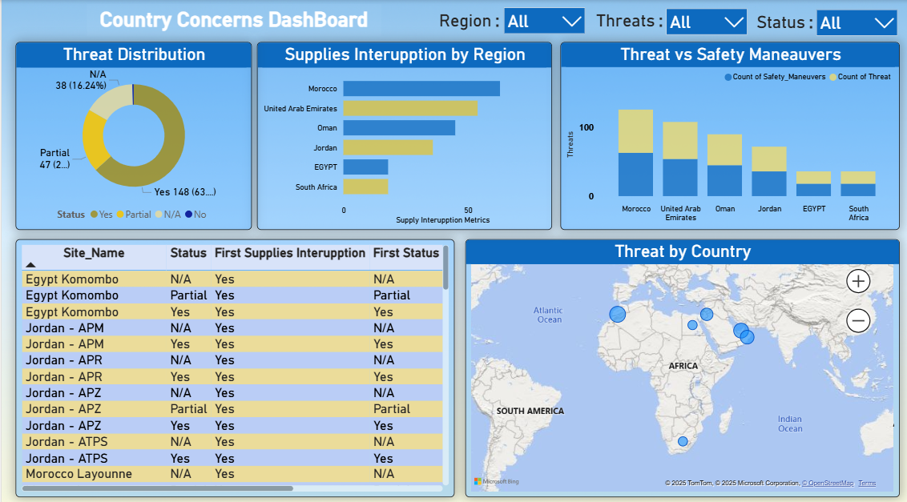

# AIVA Chatbot: Local-First, Image-Aware AI Dashboard



---

## 🚀 Overview

**AIVA Chatbot** is a futuristic, privacy-first, local AI assistant that combines advanced language models with image analysis. It runs entirely on your machine—no cloud, no external APIs—offering chat, dashboard insights, and image understanding in a beautiful, modern UI.

---

## 🏗️ Architecture & Tech Stack

- **Frontend:** React (Vite), Tailwind CSS
- **Backend:** Node.js (Express)
- **LLM Serving:** Ollama (TinyLlama, Phi-3, ImageBot)
- **Image Analysis:** Tesseract.js (OCR), Jimp (color/format), OpenCV (optional, for shapes)
- **Storage:** Browser localStorage (sessions)
- **No Cloud:** All processing is local

---

## 📁 Folder Structure

```
New_Chatbot/
├── 1.png                # Dashboard screenshot
├── backend/             # Node.js server (API, image analysis)
│   ├── eng.traineddata  # Tesseract OCR language data
│   ├── index.js         # Express server
│   ├── package.json     # Backend dependencies
├── frontend/            # React app (UI)
│   ├── index.html       # App entry
│   ├── package.json     # Frontend dependencies
│   ├── tailwind.config.js # Custom theme
│   ├── postcss.config.js  # Tailwind/PostCSS setup
│   └── src/
│       ├── App.jsx      # Main app logic
│       ├── index.jsx    # React entry
│       ├── index.css    # Global styles
│       └── components/  # UI components
├── main_ideas.txt       # Project vision & notes
└── README.md            # This file
```

---

## ✨ Features

### Frontend (React + Tailwind)
- **Modern UI:** Sidebar, chat thread, model switcher, input bar, context panel
- **Chat History:** Persistent sessions, easy switching, delete & create new chats
- **Model Switching:** Instantly toggle between TinyLlama, Phi-3, and ImageBot
- **Image Upload:** Paste or upload images, preview before sending
- **Image Analysis:** OCR, color, shape/edge detection, dashboard keyword extraction
- **Context Panel:** Quick links, extracted info, and more
- **Responsive Design:** Works on desktop and tablets

### Backend (Node.js/Express)
- **/chat:** Forwards user prompt to Ollama, returns LLM response
- **/analyze-image:** Accepts image, runs OCR (Tesseract), color/format (Jimp), shape detection (OpenCV if available), and returns a structured summary
- **No Cloud:** All processing is local, no external API calls

---

## 🖼️ Dashboard Preview


---

## 🛠️ Setup Instructions

### 1. Prerequisites
- **Node.js** (v16+ recommended)
- **npm** (comes with Node.js)
- **Ollama** (for local LLMs: https://ollama.com/)
- (Optional) **OpenCV** for advanced image analysis

### 2. Clone the Repository
```bash
git clone <your-repo-url>
cd New_Chatbot
```

### 3. Backend Setup
```bash
cd backend
npm install
# (Optional) Install OpenCV if you want shape detection:
# npm install opencv4nodejs
# Make sure eng.traineddata is present for Tesseract.js
node index.js
# Backend runs on http://localhost:3001
```

### 4. Frontend Setup
```bash
cd ../frontend
npm install
npm run dev
# Frontend runs on http://localhost:5173 (default Vite port)
```

### 5. Ollama Setup
- Download and install Ollama from https://ollama.com/
- Pull the required models:
```bash
ollama pull tinyllama
ollama pull phi3
# (Optional) ollama pull imagebot
ollama run tinyllama
```
- Ollama API runs on http://localhost:11434

---

## 🧑‍💻 Usage Guide

1. **Start Backend:** `node backend/index.js`
2. **Start Ollama:** `ollama run tinyllama` (or phi3)
3. **Start Frontend:** `npm run dev` in `frontend/`
4. **Open in Browser:** [http://localhost:5173](http://localhost:5173)
5. **Chat, upload images, switch models, and explore the dashboard!**

---

## 🖌️ Design System
- **Colors:** Deep green, olive, cream, peach, mint, pastel green
- **Fonts:** Inter, Manrope (Google Fonts)
- **Cards:** `rounded-2xl`, `shadow-lg`, `p-4`
- **Buttons:** `rounded-2xl`, `hover:bg-green-700`, `transition`
- **Typography:** `font-sans`, `text-lg`, `font-medium`
- **Responsiveness:** `md:flex`, `w-full`, `max-w-4xl`, etc.

---

## 🔒 Local-Only Guarantee
- All chat, image, and data processing is done **locally**
- No cloud APIs, no data leaves your machine
- Perfect for privacy-focused users and enterprise environments

---

## 🧩 Customization
- **Add new models:** Edit `MODELS` in `App.jsx`
- **Change theme:** Edit `tailwind.config.js`
- **Add endpoints:** Extend `backend/index.js`

---

## 🐞 Troubleshooting & FAQ

- **Ollama not running?**
  - Make sure `ollama run <model>` is active and listening on port 11434
- **Image analysis errors?**
  - Ensure `eng.traineddata` is present in `backend/`
  - OpenCV is optional, but required for shape/edge detection
- **Frontend/Backend connection issues?**
  - Check CORS settings and port numbers
- **Changed folder location?**
  - Update any hardcoded paths if you moved the project (especially for LLM models)

---

## 🙏 Credits & Acknowledgments
- **Ollama** for local LLM serving
- **Tesseract.js** for OCR
- **Jimp** for image processing
- **OpenCV** (optional) for advanced image analysis
- **React** & **Tailwind CSS** for the beautiful UI

---

## 📄 Project Vision

See `main_ideas.txt` for the full vision, roadmap, and design philosophy behind AIVA Chatbot.

---

**Enjoy your private, local-first AI dashboard!** 